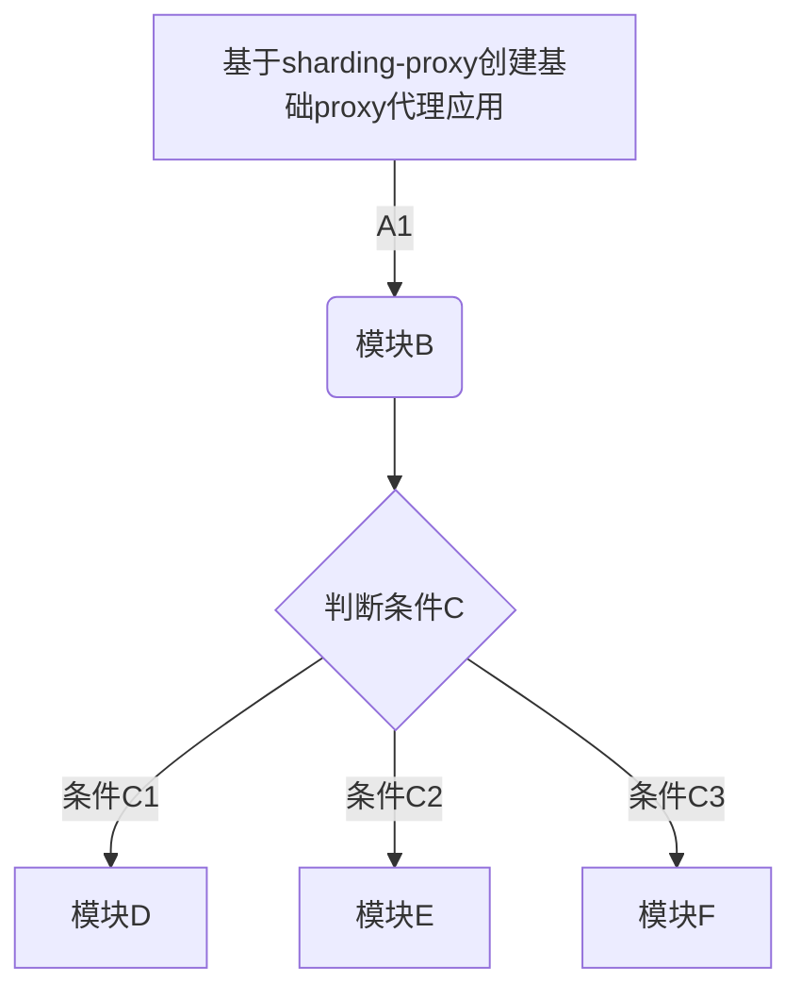

##### 分库分表使用方式
###### 客户端模式：
引入sharding-jdbc sdk，应用代码维护分库分表配置文件。
###### 代理模式：
部署sharding-proxy代理
1、存在中心化问题，多个应用使用时数据隔离性无法保证有效控制
2、存在网络消耗
###### 数据网格模式（sidecar/dockerfile）
sidecar目前sharding-sphere规划中

###### 使用方式对比
| - | Sharding-JDBC | Sharding-Proxy | Sharding-Sidecar |
| --- | --- | --- | --- |
| 数据库 | 任意 | MySQL | MySQL |
| 连接消耗数 | 高 | 低 | 低 |
| 异构语言 | 仅Java	 | 任意 | 任意 |
| 性能 | 损耗低 | 损耗略高 | 损耗低 |
| 无中心化 | 是 | 否 | 是 |
| 静态入口 | 无 | 有 | 无 |

##### 部署方案：
###### 1、sidecar模式：springboot+sharding-proxy
由容器云将应用与代理编排为一个pod，启动镜像需要保证代理先于应用启动（或应用探活补偿）

步骤：

1、改造sharding-proxy，发布基础代理应用，代理的配置信息由

1、容器云创建应用，添加sharding-proxy代理（容器云改造）
2、容器云编排配置，选择基础代理镜像

###### 路由引擎

###### 路由&分片自动化测试

###### APM应用性能监控
链路追踪方案：
1、OpenTracing协议：默认SkyWalking厂商实现
2、字节码注入
使用易宝日志组件fluent-sender+字节码注入，实现Interceptor接口

在数据库治理方面，Sharding-Sphere全数保留了之前的功能，并提供了全新的APM链路追踪数据，可以通过SkyWalking更直观的观测Sharding-Sphere。但目前仍未包括数据库弹性扩缩功能，该部分功能将于明年规划。

###### 主键生成策略
1. Snowflake
优点：分布式；单机自增；性能高；每个机器配置不一样的机器码就可以保证唯一；
缺点：服务器的时间有可能不一致，可能会出现不自增情况；
2. UUID
好处：唯一；性能高；
缺点：不可读；不是自增；
3. Redis INCR
4. ID生成服务系统

###### 编程语言解析器ANTLR
ANTLR：Another Tool for Language Recognition 编程语言解析器
1、JSQLParser
2、FDB
3、Druid

待论证：
经过实例测试，ANTLR解析SQL的性能比自研的SQL解析引擎慢3倍左右。为弥补差距，Sharding-Sphere将使用Prepared Statement的SQL解析的语法树放入缓存。因此建议采用PreparedStatement这种SQL预编译的方式提升性能。Sharding-Sphere会提供配置项，将两种解析引擎共存，交由用户抉择SQL解析的兼容性与性能。

###### 弹性伸缩

###### 流量切换方案

###### 使用规范&最佳实践
1、输出最佳实践使用文档
2、自动实现使用规范强制校验（BOSS管理？CICD校验？）

使用限制确保数据均衡 拆分数据库的数据尽量均匀，比如按省份分user库不均匀，按userid取模会比较均匀不用深分页 不带切分键的深分页，会取出所有库所取页数之前的所有数据在内存排序计算。容易造成内存溢出。减少子查询 子查询会造成SQL解析紊乱，解析错误的情况，尽量减少SQL的子查询。事务最小原则 尽量缩小单机事务涉及的库范围，即尽可能减少夸库操作，将同类操作的库/表分在一起数据均衡原则 拆分数据库的数据尽量均匀，比如按省份分user库不均匀，按userid取模会比较均匀特殊函数 distinct、having、union、in、or等，一般不被支持。或者被支持，使用之后会增加风险，需要改造。

引入分库分表之后会有什么新问题？
1、事务一致性问题；
2、跨节点Join问题；
3、跨节点排序、分页、函数使用问题：如count、order by等；
4、数据迁移、扩容；

###### 准备阶段
确定分库分表策略确定分库分表的维度和切分键。切分键（就是路由数据的column）一旦确定，是不允许修改的，所以在前期架构设计上，应该首先将其确立下来，才能进行后续的工作；数据维度多意味着有不同的切分键，达到不同条件查询的效果。这涉及到数据的冗余（多写、数据同步），会更加复杂。前期准备

数据规整库表结构不满足需求，需要提前规整。比如，切分键的字段名称不同或者类型各异。在实施分库分表策略时，这些个性会造成策略过大不好维护。扫描所有SQL将项目中所有的SQL扫描出来，逐个判断是否能够按照切分键正常运行。
在判断过程中肯定会有大量不合规的SQL，则都需要给出改造方案，这是主要的工作量之一。验证工具支持直接在原有项目上进行改动和验证是可行的，但会遇到诸多问题，主要是效率太低。我倾向于首先设计一些验证工具，输入要验证的SQL或者列表，然后打印路由信息和结果进行判断。

技术准备
建议以下提到的各个点，都找一个例子体验一下，然后根据自己的团队预估难度。以下：
中间件所有不支持的SQL类型
整理容易造成崩溃的注意事项
不支持的SQL给出处理方式
考虑一个通用的主键生成器
考虑没有切分键的SQL如何处理
考虑定时任务等扫全库的如何进行遍历
考虑跨库跨表查询如何改造
准备一些工具集

###### 实施阶段

充足的测试
分库分表必须经过充足的测试，每一句SQL都要经过严格的验证。如果有单元测试或者自动化测试工具，完全的覆盖是必要的。一旦有数据进行了错误的路由，尤其是增删改，将会创造大量的麻烦。在测试阶段，将验证过程输出到单独的日志文件，充足测试后review日志文件是否有错误的数据流向。

SQL复验

强烈建议统一进行一次SQL复验。主要是根据功能描述，确定SQL的正确性，也就是通常说的review。演练在非线上环境多次对方案进行演练，确保万无一失。

制定新的SQL规范

分库分表以后，项目中的SQL就加了枷锁，不能够随意书写了。很多平常支持的操作，在拆分环境下就可能运行不了了。所以在上线前，涉及的SQL都应该有一个确认过程，即使已经经过了充足的测试。

###### 业务调研
路由键：
清算
时间路由（上游传过来，不会变）

计费：

历史库，不存在数据迁移
批处理统计

按订单或商户路由，汇总性能（半年/一年历史查询），分片库后也归档。

剖析Sharding-Sphere系列——结果归并

步骤：SQL解析，重写，路由，执行，结果归并。